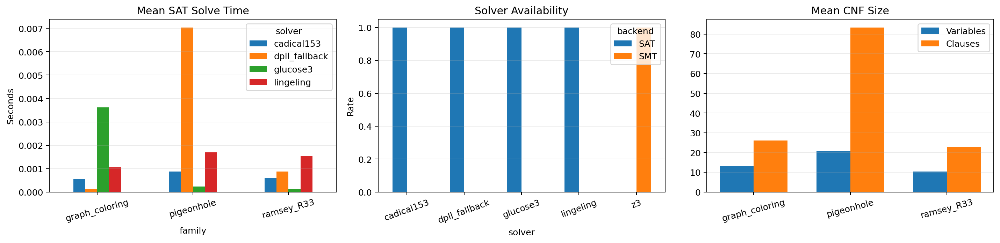

# Rapport final - B1 - Resolution automatique de theoremes par SAT

## Resume

Ce projet encode des problemes mathematiques classiques en formules booleennes sous forme CNF, puis les resout avec des solveurs SAT. Le coeur du rendu est un encodeur de Tseitin qui transforme des formules propositionnelles arbitraires en CNF lineairement, en introduisant des variables auxiliaires.

Trois familles sont implementees: coloriage de graphe, principe des tiroirs de Dirichlet et Ramsey `R(3,3)`. Les instances sont resolues avec PySAT lorsque les solveurs sont disponibles, avec un fallback DPLL pour les tests de fumee. Une comparaison SMT avec Z3 est fournie pour discuter les compromis entre encodage booleen explicite et modelisation plus haut niveau.

## Contexte et objectifs

La resolution automatique de theoremes par SAT consiste a transformer un enonce logique en une question de satisfiabilite. Pour prouver qu'une propriete est vraie, on encode souvent la negation de la propriete et on montre qu'elle est insatisfiable.

Les objectifs traites sont:

- implementer une transformation de Tseitin et un export DIMACS;
- encoder le coloriage de graphe, le pigeonhole principle et Ramsey `R(3,3)=6`;
- comparer plusieurs solveurs SAT exposes par PySAT;
- analyser les traces UNSAT lorsque le solveur et `drat-trim` sont disponibles;
- comparer SAT a un encodage SMT Z3 sur les memes familles.

## Transformation de Tseitin

Le module `src/tseitin.py` definit un petit AST propositionnel:

- `Atom`;
- `Not`;
- `And`;
- `Or`;
- `Implies`;
- `Iff`.

Chaque sous-formule recoit une variable auxiliaire. Pour une conjonction `x <-> (a1 and ... and ak)`, l'encodeur ajoute:

```text
not x or a_i              pour chaque i
x or not a1 or ... or not ak
```

Le meme principe est utilise pour `Not` et `Or`. Les implications et equivalences sont abaissees vers `Or`, `Not` et `And`. La racine est ensuite forcee vraie par une clause unitaire.

Cette approche evite la distribution naive de `and` sur `or`, qui peut provoquer une explosion exponentielle.

## Encodages SAT

### Coloriage de graphe

Variable `x_v_c`: le sommet `v` prend la couleur `c`.

Contraintes:

- chaque sommet a au moins une couleur;
- chaque sommet a au plus une couleur;
- deux sommets adjacents ne partagent pas la meme couleur.

Le benchmark utilise des cycles avec 2 couleurs. Les cycles pairs sont satisfiables, les cycles impairs sont insatisfiables.

### Pigeonhole principle

Variable `x_p_h`: le pigeon `p` est place dans le trou `h`.

Contraintes:

- chaque pigeon est place dans exactement un trou;
- deux pigeons distincts ne peuvent pas occuper le meme trou.

Les instances `n+1` pigeons dans `n` trous sont UNSAT et servent de preuves compactes du principe des tiroirs.

### Ramsey R(3,3)

Variable `e_u_v_red`: l'arete `(u, v)` du graphe complet est rouge. Faux signifie bleu.

Pour chaque triangle, le modele interdit:

- un triangle entierement rouge;
- un triangle entierement bleu.

L'instance `K_6` est UNSAT: toute 2-coloration des aretes de `K_6` contient un triangle monochromatique. L'instance `K_5` reste SAT, ce qui illustre `R(3,3)=6`.

## Solveurs

Le module `src/solver_sat.py` essaye d'utiliser PySAT avec les solveurs configures:

- `glucose3`;
- `cadical153`;
- `lingeling`.

Un solveur DPLL minimal est inclus pour les tests locaux. Il implemente propagation unitaire, elimination des litteraux purs et branchement par frequence. Il ne remplace pas CDCL: il sert a verifier les petits encodages sans dependance externe.

L'approche CDCL des solveurs modernes ajoute des mecanismes non reproduits dans le fallback:

- apprentissage de clauses apres conflit;
- backjumping non chronologique;
- heuristiques de branchement type VSIDS;
- phase saving pour reutiliser des polarites prometteuses.

## Certificats UNSAT

Le module `src/proof.py` exporte une CNF DIMACS et isole la verification de preuve. Par defaut, le script ne force pas le mode preuve PySAT en memoire, car la recuperation directe d'une trace depend du solveur et de la plateforme. Une trace produite par un solveur externe compatible peut etre verifiee par:

```bash
drat-trim instance.cnf preuve.drat
```

Cette partie est dependante de l'environnement: tous les solveurs PySAT ne produisent pas une trace accessible, et `drat-trim` doit etre installe hors de Python.

## Comparaison SMT

Le module `src/solver_smt.py` encode les memes familles dans Z3:

- couleurs de graphe par variables entieres bornees;
- pigeonhole par variables entieres et `Distinct`;
- Ramsey par variables booleennes et contraintes de triangles.

SMT donne un modele plus lisible et plus proche du probleme initial. SAT demande un encodage plus manuel, mais produit des CNF explicites, exportables, verifiables et tres efficaces pour les solveurs CDCL.

## Protocole experimental

Les experiences utilisent:

- cycles `C_5`, `C_6`, `C_7`, `C_8` en 2-coloriage;
- pigeonhole `4->3`, `5->4`, `6->5`;
- Ramsey `K_4`, `K_5`, `K_6`.

Chaque instance est resolue avec les solveurs SAT disponibles, puis avec Z3 si la dependance est installee. Les resultats sont stockes dans:

- `results/benchmark_raw.csv`;
- `results/benchmark_summary.csv`;
- `results/figures/benchmark_overview.png`.

## Resultats observes

La configuration experimentale utilise PySAT `1.9.dev5` et Z3. Les solveurs `glucose3`, `cadical153` et `lingeling` resolvent toutes les instances pedagogiques avec le statut attendu. Le fallback DPLL reste conserve comme verification minimale independante des solveurs externes.

| Approche | Famille | Taux resolu | Exactitude attendue | Temps moyen |
| :-- | :-- | --: | --: | --: |
| Glucose3 | graph coloring | 100% | 100% | 0.00362 s |
| Glucose3 | pigeonhole | 100% | 100% | 0.00023 s |
| Glucose3 | Ramsey R(3,3) | 100% | 100% | 0.00012 s |
| CaDiCaL153 | graph coloring | 100% | 100% | 0.00055 s |
| CaDiCaL153 | pigeonhole | 100% | 100% | 0.00087 s |
| CaDiCaL153 | Ramsey R(3,3) | 100% | 100% | 0.00061 s |
| Lingeling | graph coloring | 100% | 100% | 0.00106 s |
| Lingeling | pigeonhole | 100% | 100% | 0.00169 s |
| Lingeling | Ramsey R(3,3) | 100% | 100% | 0.00155 s |
| Z3 SMT | graph coloring | 100% | 100% | 0.01421 s |
| Z3 SMT | pigeonhole | 100% | 100% | 0.01035 s |
| Z3 SMT | Ramsey R(3,3) | 100% | 100% | 0.00416 s |



## Validation

Pour chaque modele SAT satisfiable, le projet verifie deux niveaux:

- satisfaction brute de toutes les clauses CNF;
- interpretation metier du modele: coloration correcte, injection pigeonhole ou absence de triangle monochromatique.

Le test de fumee `python -m src.test_solver` couvre:

- contradiction Tseitin UNSAT;
- formule Tseitin SAT;
- triangle 3-coloriable SAT;
- triangle non 2-coloriable UNSAT;
- pigeonhole `3->2` UNSAT;
- Ramsey `K_5` SAT;
- Ramsey `K_6` UNSAT.

## Limites

- Les encodages cardinalite utilisent des contraintes pairwise, simples mais moins compactes que des sequential counters ou cardinality networks.
- Le fallback DPLL n'implemente pas CDCL et ne doit pas etre utilise pour mesurer les performances reelles.
- Les certificats UNSAT dependent fortement du solveur installe et de l'acces a `drat-trim`.
- Le benchmark reste pedagogique et volontairement petit pour etre reproductible rapidement.

## Pistes d'amelioration

- Ajouter des encodages cardinalite plus compacts.
- Exporter et verifier systematiquement des traces DRAT/LRAT avec un solveur proof-producing.
- Ajouter un parseur DIMACS inverse et une comparaison avec des solveurs externes en ligne de commande.
- Etendre Ramsey a d'autres bornes et comparer les tailles CNF.

## Conclusion

Le projet B1 fournit une chaine complete de resolution SAT pedagogique: formules propositionnelles, Tseitin, DIMACS, encodages classiques, solveurs SAT, validation de modeles, comparaison SMT et support optionnel des preuves UNSAT. Il situe SAT comme outil de verification symbolique, complementaire aux approches CP-SAT d'optimisation du projet C4.
